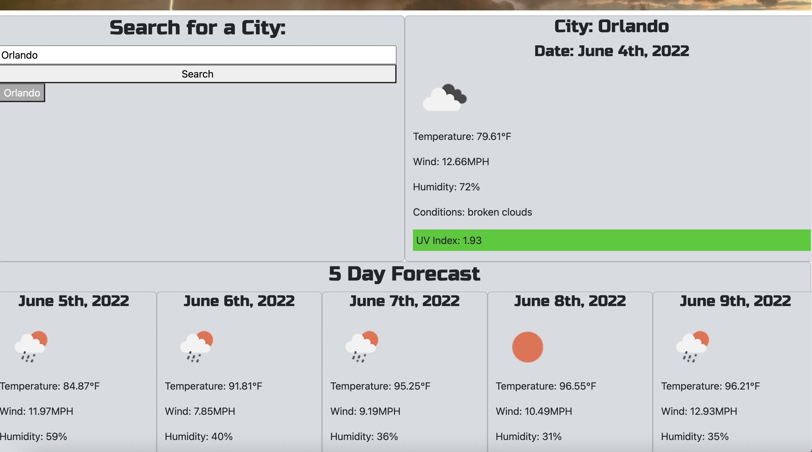
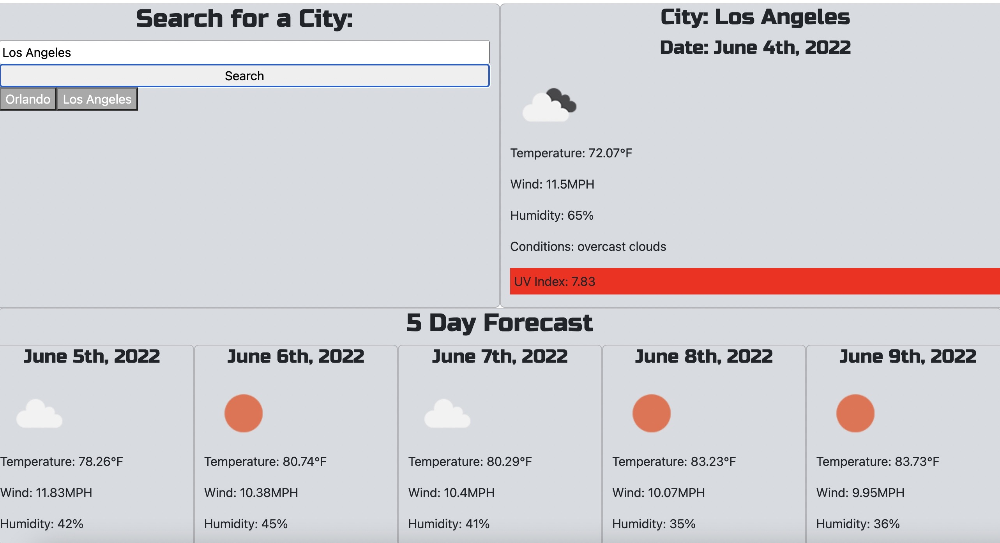

# weather-dashboard-challenge

## Purpose
To create a weather dashboard that displays the current weather and five day forecast of city user searches for. It will display an icon for the weather and the UV index will be color coded based on the UV score.

## Built With
* HTML
* CSS
* JavaScript
* Open Weather Map API

## Website
https://cdonais.github.io/weather-dashboard-challenge/

## Screenshots

